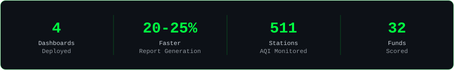

<!-- ═══════════════════ WAVING HEADER ═══════════════════ -->

<!-- ═══════════════════ TYPING TEXT ═══════════════════ -->

 

<!-- ═══════════════════ BUTTONS ═══════════════════ -->

 

## `> whoami`

**B.Tech Computer Science (Data Science)** graduate from ABESIT, Ghaziabad (2026), now pursuing an **MBA in Business Analytics** at NMIMS CDOE.

I build dashboards and analytics platforms that answer real business questions. At **NCRTC**, I designed and deployed 4 Power BI MIS dashboards tracking real-time KPIs for India's PM-eBus Sewa national fleet programme, and cut dashboard generation time by **20-25%**. I also built full-stack analytics products end to end: a mutual fund scoring platform and a live national AQI tracker covering **511 monitoring stations** across 28 states.

Data is only useful when it changes a decision. I try to build the kind of visuals that actually do that.

Currently open to **Data Analyst**, **BI Analyst**, and **Business Analyst** roles in Delhi NCR.

  

## `> ls ./experience`

### NCRTC | IT Intern, Data Analytics `Sep 2025 – Nov 2025`
> **Problem:** Ministry-level KPI reporting for the PM-eBus Sewa national fleet programme was slow and manually intensive.

- Designed and deployed **4 Power BI MIS dashboards** using advanced DAX measures to track real-time operational KPIs, giving ministry-level stakeholders continuous visibility into fleet performance.
- Partnered directly with the **Senior GM/IT** to redesign MIS report layouts across all 4 dashboards, standardising KPI presentation for easier cross-team reading.
- Automated manual MIS reporting with **Excel macros and Power Query** and optimised the underlying SQL queries, cutting dashboard generation time by **20-25%** and report refresh time by roughly **25%**.
- Presented findings and KPI trends in biweekly reviews with a 5-6 person IT leadership team, translating technical metrics into plain-language insights.
- Coordinated across **3 stakeholder groups** (IT, operations, ministry liaisons) to gather requirements and validate KPI definitions before each dashboard rollout.

`Power BI` `DAX` `SQL` `Power Query` `Excel` `VBA Macros`

## `> ls ./projects`

### FundScope | Full-Stack Mutual Fund Analytics Platform `2026`
> **Problem:** Retail investors had no objective, data-driven tool to screen, score, and compare mutual funds beyond distributor-recommended shortlists.

- Built a full-stack platform on **Next.js 15** and **Python/SQLite**, pulling live NAV, returns, and holdings data from the **AMFI API** and **yfinance** to power fund screening and comparison.
- Engineered a Python scoring model using **CAGR, Sharpe ratio, and Alpha** to rank **32 curated funds across 5 categories**, surfacing performance trends an average investor would miss.
- Designed interactive 3D visualisation components and a unified motion/animation system to turn raw fund data into a decision-ready interface.
- Developed **FundBot**, a grounded AI assistant handling natural-language queries across 5 categories (returns, risk, comparison, holdings, screening).

`Next.js 15` `TypeScript` `Python` `SQLite` `AMFI API` `yfinance` `Recharts` `Framer Motion` `Tailwind CSS`

---

### India AQI Dashboard | AI-Powered National Air Quality Tracker `2026`
> **Problem:** No unified public platform tracked air-quality health risk across Indian cities using CPCB-standard AQI calculations.

- Architected a national tracker aggregating live pollution data from **511 monitoring stations across 28 states**, with daily, weekly, and monthly trend breakdowns.
- Built medical alert metrics on the **CPCB 6-tier AQI severity scale** (Good to Severe), translating raw readings into clear health-risk guidance.
- Integrated **Gemini AI** to generate hourly, contextual health-risk insights from raw sensor data.
- Implemented the front end in **React 19 and TypeScript** with **Leaflet** maps for geospatial visualisation; deployed and debugged the production build on GitHub Pages.

`React 19` `TypeScript` `Python` `Gemini AI` `Recharts` `Leaflet` `Tailwind CSS` `Vite` `REST API`

## `> cat ./skills.txt`

**Analytics & BI**

**Programming & Databases**

**AI, Cloud & Tools**

**Core competencies:** MIS Reporting & Automation · KPI Dashboards · Data Storytelling · Trend Analysis · Ad-hoc Analysis · EDA · Data Cleaning & Transformation · Statistical Analysis · Advanced Excel (VLOOKUP, XLOOKUP, INDEX-MATCH, Pivot Tables) · Business Requirements Analysis · Stakeholder Management · Cross-functional Collaboration · Process Improvement

## `> git log --stats`

<!-- ═══════════════════ CONTRIBUTION SNAKE ═══════════════════ -->

<picture>
  <source media="(prefers-color-scheme: dark)" srcset="https://raw.githubusercontent.com/Amol257/Amol257/output/github-contribution-grid-snake-dark.svg" />
  <source media="(prefers-color-scheme: light)" srcset="https://raw.githubusercontent.com/Amol257/Amol257/output/github-contribution-grid-snake.svg" />
  
</picture>

## `> cat ./education.txt`

- **MBA, Business Analytics** | NMIMS CDOE, Mumbai | 2026 – Present
- **B.Tech, Computer Science (Data Science)** | ABESIT, Ghaziabad (AKTU) | 2022 – 2026

## `> cat ./certifications.txt`

- Generative AI | Hack2Skill in collaboration with Google Cloud (May 2025)
- Cloud Computing | IBM / PBEL Virtual Internship (Aug 2025)
- Excel for Data Analysis | Udemy (2025)

## `> ./contact --open`

Open to **Data Analyst**, **BI Analyst**, and **Business Analyst** roles in Delhi NCR.

If you are hiring, want to collaborate, or just want to talk data, reach out.

 

<!-- ═══════════════════ WAVING FOOTER ═══════════════════ -->

